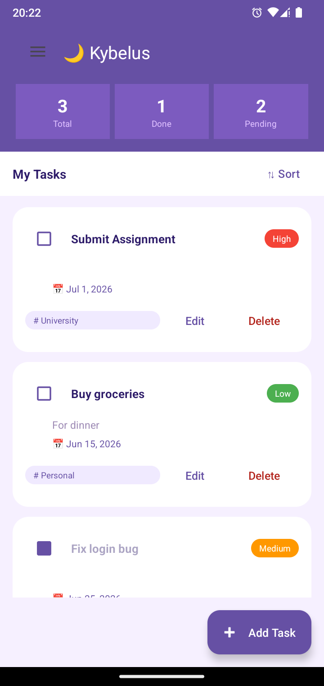
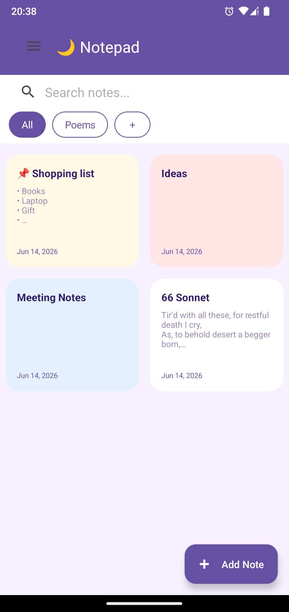
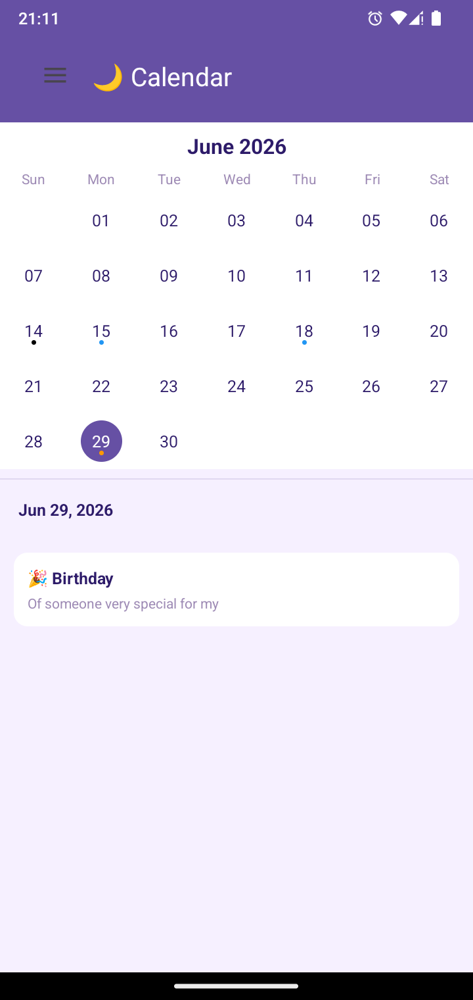

# 🌙 Kybelus

Kybelus is a personal productivity app for Android that brings your tasks, notes, and calendar together in one clean workspace.

---

## 📸 Screenshots

<p align="center">
  
  &nbsp;&nbsp;
  
  &nbsp;&nbsp;
  
</p>

---

## ✨ Features

### ✅ Tasks
- Create tasks with title, description, priority (Low / Medium / High) and due date
- Tag tasks by category (e.g. Work, Personal)
- Mark tasks as complete
- Sort by priority, due date, or completion status
- View total, completed and pending task counts at a glance

### 📝 Notepad
- Create notes with bold, italic, font size and list formatting
- Choose a background color per note
- Pin important notes to the top
- Organize notes with custom tags
- Search notes instantly

### 📅 Calendar
- Monthly calendar view with swipe to navigate between months
- See tasks and events marked with colored dots per day
- Add events to any day by long pressing
- View all events and tasks for a selected day

### ⚙️ Settings
- Dark mode toggle
- Set a daily reminder time for task and event notifications
- Choose a default note color
- Set the default screen on app launch

---

## 📲 Installation

1. Download **[Kybelus.apk](Kybelus.apk)** from this repository
2. On your Android phone, go to **Settings → Security** (or **Privacy** on some devices)
3. Enable **"Install unknown apps"** or **"Allow from this source"**
4. Open the downloaded APK file
5. Tap **Install**
6. Open **Kybelus** and enjoy 🌙

> Requires Android 8.0 or higher

---

## 🔔 Permissions Explained

When you first open Kybelus, you may see two permission prompts. Here is why the app needs them:

### "Allow Kybelus to send notifications?"
Kybelus can remind you about upcoming tasks and events at a time you choose in Settings. If you enable reminders, the app sends you a notification on the due date of your task or event. You can disable this anytime from Settings → Reminders or from your phone's notification settings.

### "Allow app to run in background / ignore battery optimizations?"
For reminders to fire reliably — even when the app is closed — Kybelus needs to be excluded from your phone's battery optimization. Without this, Android may put the app to sleep and your reminders might not arrive on time. You can decline this and the app will still work normally, but reminder notifications may occasionally be delayed or missed, if battery optimization is on.

---

## 🛠️ Built With

- **Kotlin**
- **MVVM Architecture** — ViewModels + LiveData + Repositories
- **Room Database** — local storage for tasks, notes, events and tags
- **Material Design 3** components
- **Navigation Drawer** for screen navigation
- **AlarmManager** for scheduled reminders

---

## 📁 Project Structure

```
app/
└── src/main/
    ├── java/kybelus/app/
    │   ├── tasks/         # Task feature (ViewModel, Repository, DAO, Adapter)
    │   ├── notepad/       # Note feature (ViewModel, Repository, DAO, Adapter)
    │   ├── calendar/      # Calendar & Events feature
    │   ├── notifications/ # Reminder scheduling & receiver
    │   ├── MainActivity.kt
    │   ├── SettingsFragment.kt
    │   └── KybelusDatabase.kt
    └── res/
        ├── layout/        # XML layouts (fragments, dialogs, list items)
        ├── anim/          # Transition animations
        ├── drawable/      # Shape drawables
        ├── menu/          # Navigation menu
        ├── values/        # Colors, strings, themes, styles
        └── values-night/  # Dark mode overrides
```

---

<p align="center">Made by Oriotic🌙</p>
